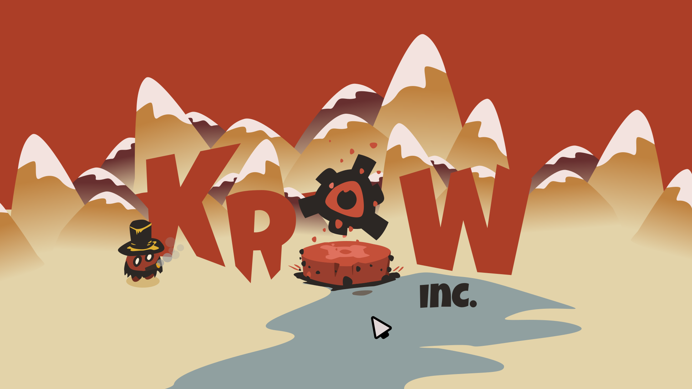

# ⚙️ [Krow.Inc]
**An entry for the Gamedev.js Jam 2026 - Theme: Machines**

> *"BECOME THE MACHINE. PRODUCE OR PERISH."*

[Krow.Inc] is a frantic management and survival minigame collection where you control the ultimate corporate machine. Drag and drop workers into work zones, survive the crashing stock market graphs, and type your way to maximum corporate efficiency. 

Play it live here: **[Link to Wavedash/Itch.io build]**

---

## 🎮 Gameplay & Features

* **Worker Management:** Drag and drop workers into their designated work zones before the timer runs out.
* **Corporate Typing:** A CRT-styled typing minigame featuring oppressive corporate mantras.
* **Stock Market Survival:** A high-speed avoidance minigame where you ride the stock graph and dodge market crashes.
* **Massive Horde Ending:** A cinematic finale featuring a custom spawning algorithm handling hundreds of Spine2D animated workers pushing the limits of the web browser.

*(Insert a cool GIF of the gameplay here!)*

---

## 🛠️ Technical Overview & How to Run

This project is open-source and built for the web using Godot 4.6.1. 

### Requirements
* **Godot Engine:** Version 4.6.1 (with Spine2D runtime support).
* **Spine2D:** Required to properly render the skeletal animations of the workers and interactive elements.

### Running locally
1. Clone this repository: `git clone https://github.com/yourusername/your-repo-name.git`
2. Open Godot 4.6.1 (ensure you have the Spine-Godot runtime version).
3. Import the `project.godot` file.
4. Run the project (F5).

*Note: The Wavedash SDK is already included in the `res://wavedash/` directory for leaderboard and web-service integrations.*

---

## 👥 The Team

* **[Alvaro Roldan](https://github.com/tu-github)** - Lead Developer
* **[Natalia Ospinal](https://github.com/github-de-natalia)** - Developer
* **[Peter](link-al-portfolio-de-peter)** - Art & Animation
* **[Adrian Alcalá](link-al-portfolio-de-adrian)** - Music & SFX

---

## 📄 License
This project is licensed under the [MIT License](LICENSE) - see the LICENSE file for details.
